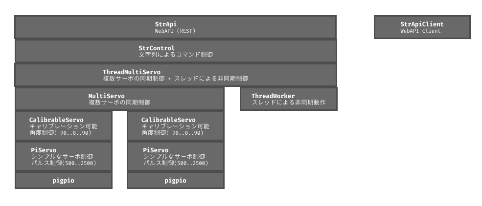

# piservo0: 

`piservo0` は、Raspberry Piでサーボモーターを精密に制御するためのPythonライブラリです。
`pigpio`ライブラリを基盤とし、安価なサーボモーター(SG90など)を複数、同期させて動かすことに重点を置き、サーボモーターごとの個体差を吸収するためのキャリブレーション機能もあります。


## == 特徴

### === `pigpio`をベースにしているので…

- ***追加ハードウェア不要*** : PCA9685などのモータードライバー回路は不要です。Raspberry PiのGPIOで、直接サーボを制御できます。
- ***ほぼすべてのGPIOを使える*** : PWM用のピンを選ぶ必要はありません。柔軟性が高く、多数のサーボを使えます。
- ***高性能*** : Raspberry Pi Zeroでも、多数のサーボを問題なく同時に動かせます。


### === さらに、本ライブラリでは…

- ***複数のサーボを同期*** : ロボットの制御に最適です。
- ***キャリブレーション(補正)機能*** : -90度、 0度、+90度の位置を補正でき、ファイルに補正値を保存します。安価なサーボをより実用的に利用できます。
- ***ネットワーク経由***で、***`REST API`***で制御することもできます。
- ***シンプルなAPIも用意*** : 入門用としても最適です。


## == インストール

**1. `pigpio`のインストールと起動**

このライブラリは、`pigpio`デーモンが動作している必要があります。
まず、`pigpio`をインストールし、デーモンを起動してください。

```bash
# pigpioのインストール (Raspberry Pi OSにはプリインストールされていることが多いです)
sudo apt install pigpio

# pigpioデーモンの起動
sudo systemctl enable pigpiod
sudo systemctl start pigpiod
```


**2. 開発環境の設定 -- `mise`と`uv`のインストール**

`mise` は、プロジェクトごとにPythonのバージョンなどを管理するツールです。
`uv` は、高速なPythonパッケージ管理ツールです。

```bash
# miseのインストール
curl https://mise.run | sh
# PATHを通す
echo 'eval "$(~/.local/bin/mise activate bash)"' >> ~/.bashrc
# (ターミナルを再起動)

# mise経由でuvをインストール
mise use --global uv@latest
```


**3. リポジトリのクローンとセットアップ**

```bash
# 任意の作業ディレクトリを作成
mkdir -p ~/work
cd ~/work

# リポジトリをクローン
git clone https://github.com/ytani01/piservo0.git
cd piservo0

# 仮想環境の作成と有効化
uv venv
source .venv/bin/activate

# 依存関係のインストール
uv pip install -e .        # 実行用
uv pip install -e '.[dev]' # 開発用
```


## == 使い方

このライブラリは、単純なものから複雑なものまで、段階的に使えるように設計されています。

### === 1. 基本的な使い方 (`PiServo`)

`PiServo`クラスは、指定したGPIOピンに接続されたサーボを、パルス幅で制御する最も基本的な機能を提供します。
最も手軽に使えますが、正確な角度を指定したり、複数のサーボを同期させたりすることはできません。

```python
# GPIO17に接続されたサーボをパルス幅で動かす例
import time
import pigpio
from piservo0 import PiServo

pi = pigpio.pi()         # pigpioの初期化
servo = PiServo(pi, 17)  # GPIO17に接続されたサーボモーターの初期化

servo.move_pulse(2000)   # パルス幅2000に動かす 
time.sleep(1)            # 1秒間スリープ
servo.move_pulse(1000)   # パルス幅1000に動かす

servo.off()              # サーボOFF
pi.stop()                # pigpioの終了
```

### === 2. キャリブレーション機能を使う (`CalibrableServo`)

安価なサーボモーターは、製品の個体差により、同じパルス幅でも回転角度が微妙に異なります。
`CalibrableServo`クラスを使うと、各サーボの最小(-90度)、中央(0度)、最大(+90度)の位置を調整し、その設定を `servo.json` ファイルに保存できます。

これにより、より正確な角度での制御が可能になります。

***キャリブレーションツール***

詳しくは、コマンド内の [h]キーで、ヘルプ画面を参照してください。

```bash
uv run piservo0 calib 17

Calibration Tool: 'h' for help, 'q' for quit
 :
GPIO17: 0 deg: pulse=1560> 
 :
```

***サンプルプログラム***

```python
# samples/sample_02_calibrable_servo.py
import time
import pigpio
from piservo0 import CalibrableServo

PIN = 18

pi = pigpio.pi()
if not pi.connected:
    print("pigpio not connected.")
    exit()

# CalibrableServoはキャリブレーション値をファイルから読み込みます
servo = CalibrableServo(pi, PIN)

try:
    # -90度から90度の範囲で角度を指定して動かす
    for angle in [-90, -45, 0, 45, 90, 0]:
        print(f"Move to {angle} deg")
        servo.move_angle(angle)
        time.sleep(1)

finally:
    print("Turning off")
    servo.off()
    pi.stop()
```

### === 3. 複数のサーボを動かす (`MultiServo`)

`MultiServo`クラスは、複数の`CalibrableServo`をまとめて扱います。
ロボットアームのように、複数のサーボを同時に、異なる角度に動かしたい場合に便利です。

さらに、`move_angle_sync`メソッドを使うと、複数のサーボがそれぞれの目標角度まで、指定した時間をかけて同時に到着するように、滑らかに動かすことができます。これにより、ロボットのダンスのような、より自然で協調した動きが実現できます。

***サンプルプログラム***

```python
# 
import time
import pigpio
from piservo0 import MultiServo

PINS = [18, 23, 24, 25]

pi = pigpio.pi()
if not pi.connected:
    print("pigpio not connected.")
    exit()

dance_bot = MultiServo(pi, PINS)

# ダンスの振り付け
dance_moves = [
    {"angles": [90, -90, 90, -90], "time": 2.0},
    {"angles": [-90, 90, -90, 90], "time": 2.0},
    {"angles": [45, -45, 45, -45], "time": 0.5},
    {"angles": [-45, 45, -45, 45], "time": 0.5},
    {"angles": [0, 0, 0, 0], "time": 1.0},
]

try:
    print("Start Dance!")

    for move in dance_moves:
        print(f"Moving to {move['angles']} in {move['time']}s")

        dance_bot.move_angle_sync(
            dance_move["angles"], move_sec=dance_move["time"]
        )

        time.sleep(1)

    print("Finish!")

finally:
    print("Turning off")
    dance_bot.off()
    pi.stop()
```

### === 4. 応用的な使い方: 非同期制御 (`ThreadMultiServo`)

`ThreadMultiServo` は、バックグラウンドスレッドでサーボモーターを制御するため、メインプログラムの実行をブロックせずに複数のサーボを同期して動かすことができます。これにより、より複雑なロボットの動作や、リアルタイム性が求められるアプリケーションに適しています。

***サンプルプログラム***

```python
# ``ThreadMultiServo``の例
import time
import pigpio
from piservo0 import ThreadMultiServo

PINS = [18, 21]

pi = pigpio.pi()

# ThreadMultiServoのインスタンスを作成
# バックグラウンドスレッドが自動的に開始される
servo = ThreadMultiServo(pi, PINS)

# コマンドをキューに追加し、バックグラウンドで実行
servo.move_angle_sync([90, -90], move_sec=3) #  3秒かけて動かす
# 非同期なので、メソッド呼び出しからは、すぐに帰ってくる。

# 前の動作が完了する前に、次の動作を呼び出すことができる。
servo.move_angle_sync([0, 0], move_sec=2)    #  2秒かけて動かす
# 非同期なので、メソッド呼び出しからは、すぐに帰ってくる。

time.sleep(6)  # 上記動作の終了を待つ

# 終了処理
servo.end()
pi.stop()
```

**実行方法:**

```bash
# 仮想環境が有効化されていることを確認
# source .venv/bin/activate

# サンプルコードを実行
python samples/sample_01_piservo.py
```


## == コマンド体系

本ライブラリでは、動作を指示するために「JSONコマンド」と「短縮文字列コマンド」の2種類の書式が利用されます。

### === JSONコマンド

`ThreadMultiServo` や `Web JSON API` で使用される、より詳細な制御が可能なコマンド形式です。

- **書式**: `{"cmd": "コマンド名", "パラメータ名": 値, ...}`
- **例**: 
  - `{"cmd": "move_angle_sync", "target_angles": [40, 30, null, 10]}`
    - 複数のサーボを同期して指定角度に移動（`null`は現在の角度を維持）
  - `{"cmd": "sleep", "sec": 1.5}`
    - 1.5秒待機
  - `{"cmd": "move_sec", "sec": 0.5}`
    - `move_angle_sync` のデフォルト動作時間を0.5秒に設定

より詳細なコマンド一覧は [`docs/JSON_CMD.md`](docs/JSON_CMD.md) をご覧ください。

### === 短縮文字列コマンド

`Web String API` などで、より手軽にコマンドを送信するための簡易的な形式です。内部でJSONコマンドに変換されます。

- **書式**: `コマンド種別:パラメータ`
- **例**: 
  - `mv:40,30,.,10` -> 4つのサーボをそれぞれ 40度, 30度, 現在位置, 10度 に動かす
  - `sl:1.5` -> 1.5秒待機
  - `ms:0.5` -> デフォルトの動作時間を0.5秒に設定
  - `ca` -> コマンドキューをキャンセル

より詳細なコマンド一覧は [`docs/STR_CMD.md`](docs/STR_CMD.md) をご覧ください。


## == CLI / Web API

### === コマンドラインからの操作

`piservo0` は、コマンドラインから直接サーボを操作する機能も提供します。

**書式:**
```bash
# 仮想環境が有効化されていることを確認
# source .venv/bin/activate

# 単一のサーボモーターをパルスで制御
piservo0 servo --help
piservo0 servo 18 1500

# サーボ‐モーターのキャリブレーション 
piservo0 calib --help
piservo0 calib 18

# 複数サーボの同時操作
piservo0 multi --help
piservo0 multi 18 21

# 文字列コマンドをJSONに変換して、Web JSON APIに送信
piservo0 str-client --help
piservo0 str-client 'mv:c,c,c,c'
```
`str-client`の詳細は、[`docs/STR_CLIENT.md`](docs/STR_CLIENT.md) をご覧ください。


### === Web API

Web APIを使えば、HTTP経由でリモートから制御することができます。

◆◆ **`Web JSON API`** ◆◆

JSON形式で、より複雑なコマンドシーケンスを送信できます。

**サーバーの起動:**
```bash
uv run piservo0 web-json-api 18 23 24 25
```

**クライアントからの操作例:**
```bash
# 複数のコマンドをJSON配列で一度に送信
curl -X POST -H "Content-Type: application/json" \
-d \
'[ \
    {"cmd": "move_angle_sync", "target_angles": [90, -90, 90, -90], "move_sec": 1.0}, \
    {"cmd": "sleep", "sec": 0.5}, \
    {"cmd": "move_angle_sync", "target_angles": [0, 0, 0, 0], "move_sec": 1.0} \
]' \
http://<RaspberryPiのIP>:8000/cmd
```

## == 使用するGPIOピンについて

ほとんどのGPIOピンを使うことができます。

### === 1. コマンドで確認
```
pinout
```

```
   3V3  (1) (2)  5V
 GPIO2  (3) (4)  5V
 GPIO3  (5) (6)  GND 
 GPIO4  (7) (8)  GPIO14
   GND  (9) (10) GPIO15
GPIO17 (11) (12) GPIO18
GPIO27 (13) (14) GND
GPIO22 (15) (16) GPIO23
   3V3 (17) (18) GPIO24
GPIO10 (19) (20) GND
 GPIO9 (21) (22) GPIO25
GPIO11 (23) (24) GPIO8 
   GND (25) (26) GPIO7 
 GPIO0 (27) (28) GPIO1 
 GPIO5 (29) (30) GND
 GPIO6 (31) (32) GPIO12
GPIO13 (33) (34) GND
GPIO19 (35) (36) GPIO16
GPIO26 (37) (38) GPIO20
   GND (39) (40) GPIO21
```

### === 2. 公式サイト情報
[Raspberry Pi Pinout](https://pinout.xyz/)


## ソフトウェア内部情報

### === ソフトウェア・アーキテクチャ




### === APIリファレンス ===

より詳しいクラスやメソッドの仕様については、以下のコマンドを実行してください。

```bash
uv run python -m pydoc piservo0
```

### === 他のプロジェクトから依存ライブラリとして、本プロジェクトを参照する場合の例 ===

`pyproject.toml`
```
:
dependencies = [
    "piservo0",
]
:
[tool.uv.sources]
piservo0 = { path = "../piservo0" }
:
```

## == 依存ライブラリ

- [pigpio](https://abyz.me.uk/rpi/pigpio/)
- [click](https://pypi.org/project/click/)

## == ライセンス

このプロジェクトはMITライセンスです。詳細は [`LICENSE`](LICENSE) ファイルをご覧ください。

```
