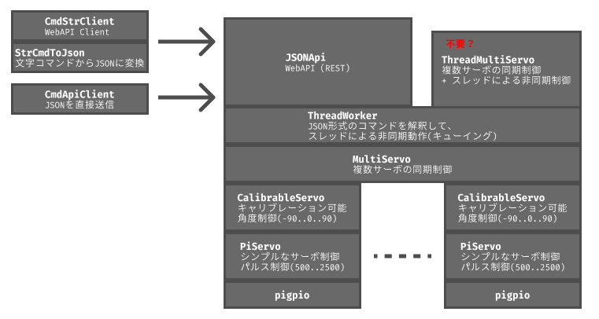

# piservo0

`piservo0` は、Raspberry Piでサーボモーターを精密に制御するためのPythonライブラリです。
`pigpio`ライブラリを基盤とし、安価なサーボモーター(SG90など)を複数、同期させて動かすことに重点を置き、サーボモーターごとの個体差を吸収するためのキャリブレーション機能もあります。



## 特徴

- **追加ハードウェア不要**: `pigpio`を利用するため、PCA9685のような追加のドライバー回路なしで、Raspberry PiのGPIOから直接サーボを制御できます。
- **柔軟なピン割り当て**: ほぼ全てのGPIOピンをサーボモーターの制御に使用できます。
- **高性能**: Raspberry Pi Zeroのような比較的性能の低いデバイスでも、多数のサーボを滑らかに同期させて動かせます。
- **キャリブレーション機能**: サーボモーターの個体差を吸収するため、-90度、0度、+90度の位置を補正し、設定をファイルに保存できます。
- **多彩な制御方法**: 同期/非同期制御、コマンドラインからの直接操作、ネットワーク越しのREST APIなど、シンプルなものから高度なものまで、幅広い制御が可能です。
- **リモート制御**: REST APIで、リモートから制御することができます。


## 1. インストール

Raspbeery Pi OS のインストール・初期設定後、以下を行ってください。

### **1.1. `pigpio`のインストールと起動**

本ライブラリは`pigpio`デーモンが動作している必要があります。

```bash
# Raspberry Pi OSにはプリインストールされていることが多いです
sudo apt update
sudo apt install pigpio

# pigpioデーモンの起動と自動起動設定
sudo systemctl start pigpiod
sudo systemctl enable pigpiod
```


### **1.2. 開発環境のセットアップ**

`mise` と `uv` を使って、プロジェクトのPython環境を管理することをお勧めします。

```bash
# mise (各種開発ツールの管理) のインストール
curl https://mise.run | sh
~/.local/bin/mise --version

# uv (高速なPythonパッケージ管理ツール) のインストール
mise use --g uv@latest
```

*シェルを再起動後、`mise`のパス設定を促された場合は、指示に従ってください。*


### **1.3. `piservo0`のインストール**

```bash
# リポジトリをクローン
git clone https://github.com/ytani01/piservo0.git
cd piservo0

# 仮想環境の作成 (有効化は不要！..その代わり「uv」を使う。)
uv venv

# 依存関係のインストール
uv pip install -e .

# 開発・テスト用
uv pip install -e '.[dev]'
```


## 2. ライブラリとしての利用

T.B.D.


## 3. コマンドラインツールを使った使い方(例)

`uv run piservo0`には、複数のサブコマンドがあり、キャリブレーションやAPIのサーバー/クライアントを実行することができます。

各サブコマンドに、'-h'をつけると、そのサブコマンドのコマンドラインに関するヘルプが表示されます。

| - sub-command - | - description -           |
| :---            | :---                      |
| calib           | calibration tool          |
| api-server      | JSON API Server           |
| api-client      | API Client (JSON)         |
| str-client      | String Command API Client |
| servo           | servo command             |


### 3.1. キャリブレーション方法

以下のコマンドで、サーボモーターを一つずつ対話的にキャリブレーションすることができます。


**コマンド起動方法**

```bash
uv run piservo0 calib 17
```

起動後「h」でヘルプが表示されます。

```text
GPIO17: 0 deg: pulse=1500> === Usage ===

* Select target (Cyclic):

 -90 deg ------[TAB]-----> 0 deg ------[TAB]-----> 90 deg
 -90 deg <-[Shift]+[TAB]-- 0 deg <-[Shift]+[TAB]-- 90 deg

* Move: (Upper case is for fine tuning)

        [w], [Up] ,[k]
              ^
              v
        [s],[Down],[j]

* Save: [ENTER],[SPACE] : save current pulse

* Misc: [q], [Q] : Quit
        [h], [?] : Show this help

* conf_file: /home/ytani/servo.json

* GPIO17
   -90 deg: pulse =  620
     0 deg: pulse = 1500
    90 deg: pulse = 2500

GPIO17: 0 deg: pulse=1500>
```


### 3.2 APIサーバーの起動

```bash
# サブコマンド一覧表示
uv run piservo0 api-server 17 27 22 25
```


### 3.3 APIクライアントCLI (JSON版)

対話的で JSON形式のコマンドをAPIサーバーに送信するCLI。

JSONコマンドの詳細については、以下を参照してください。

- [JSONCMD_SAMPLES.md](docs/JSONCMD_SAMPLES.md) 

```bash
uv run piservo0 api-client
```


### 3.4 String Command API Client CLI

対話形式で、簡略化された独自の文字列コマンドを入力すると、内部でJSONに変換しサーバーに送信します。

文字列コマンドについては、以下を参照してください。

- [STR_CMD.md](docs/STR_CMD.md)

```bash
# ローカルでデフォルト設定の場合
uv run piservo0

# モーターの回転方向を指定する場合
uv run piservo0 --angle_factor -1,-1,1,1

# リモート接続の例
uv run piservo0 --angle_factor -1,-1,1,1 --url http://192.168.x.x:8000/cmd
``` 
