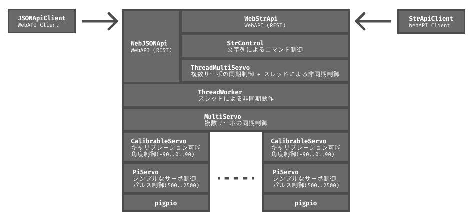

# piservo0

`piservo0` は、Raspberry Piでサーボモーターを精密に制御するためのPythonライブラリです。
`pigpio`ライブラリを基盤とし、安価なサーボモーター(SG90など)を複数、同期させて動かすことに重点を置き、サーボモーターごとの個体差を吸収するためのキャリブレーション機能もあります。



## 特徴

- **追加ハードウェア不要**: `pigpio`を利用するため、PCA9685のような追加のドライバー回路なしで、Raspberry PiのGPIOから直接サーボを制御できます。
- **柔軟なピン割り当て**: ほぼ全てのGPIOピンをサーボモーターの制御に使用できます。
- **高性能**: Raspberry Pi Zeroのような比較的性能の低いデバイスでも、多数のサーボを滑らかに同期させて動かせます。
- **キャリブレーション機能**: サーボモーターの個体差を吸収するため、-90度、0度、+90度の位置を補正し、設定をファイルに保存できます。
- **多彩な制御方法**: 同期/非同期制御、コマンドラインからの直接操作、ネットワーク越しのREST APIなど、シンプルなものから高度なものまで、幅広い制御が可能です。

## インストール

**1. `pigpio`のインストールと起動**

本ライブラリは`pigpio`デーモンが動作している必要があります。

```bash
# Raspberry Pi OSにはプリインストールされていることが多いです
sudo apt update
sudo apt install pigpio

# pigpioデーモンの起動と自動起動設定
sudo systemctl start pigpiod
sudo systemctl enable pigpiod
```

**2. 開発環境のセットアップ**

`mise` と `uv` を使って、プロジェクトのPython環境を管理することをお勧めします。

```bash
# mise (Pythonバージョン管理) のインストール
curl https://mise.run | sh

# uv (高速なPythonパッケージ管理ツール) のインストール
mise use --global uv@latest
```
*シェルを再起動後、`mise`のパス設定を促された場合は、指示に従ってください。*

**3. `piservo0`のインストール**

```bash
# リポジトリをクローン
git clone https://github.com/ytani01/piservo0.git
cd piservo0

# 仮想環境の作成と有効化
uv venv
source .venv/bin/activate

# 依存関係のインストール
uv pip install -e .
# 開発・テスト用
uv pip install -e '.[dev]'
```

## 使い方

`piservo0`は、単純なものから複雑なものまで、段階的に使えるようにクラスが設計されています。

### 1. 基本的な使い方 (`PiServo`)

１つのサーボモーターを、パルス幅で直接制御する最もシンプルなクラスです。

```python
# samples/sample_01_piservo.py
import time
import pigpio
from piservo0 import PiServo

pi = pigpio.pi()
servo = PiServo(pi, 17)  # GPIO17に接続

servo.move_pulse(2000)
time.sleep(1)
servo.move_pulse(1000)

servo.off()
pi.stop()
```

### 2. 正確な角度で制御する (`CalibrableServo`)

サーボの個体差を補正（キャリブレーション）し、より正確な角度で制御します。
以下のコマンドで、対話的にキャリブレーションを行えます。

```bash
uv run piservo0 calib 17
```

キャリブレーション後は、このように角度を指定して動かせます。
詳細は `samples/sample_02_calibrable_servo.py` をご覧ください。

```python
from piservo0 import CalibrableServo

# キャリブレーション値は自動でファイルから読み込まれます
servo = CalibrableServo(pi, 18)

# -90度から90度の範囲で角度を指定
servo.move_angle(90)
```

### 3. 複数のサーボを同期して動かす (`MultiServo`)

複数のサーボをまとめて、滑らかに同期させて動かします。ロボットアームや多脚ロボットの制御に最適です。
詳細は `samples/sample_03_multi_servo.py` をご覧ください。

```python
from piservo0 import MultiServo

dance_bot = MultiServo(pi, [18, 23, 24, 25])

# 4つのサーボを、2秒かけてそれぞれ指定の角度へ同時に動かす
dance_bot.move_angle_sync(
    [90, -90, 90, -90],
    move_sec=2.0
)
```

### 4. 非同期で制御する (`ThreadMultiServo`)

`MultiServo`の機能を、バックグラウンドスレッドで実行します。
メインの処理を止めることなく、複雑な動作をさせ続けることができます。

```python
from piservo0 import ThreadMultiServo

servo = ThreadMultiServo(pi, [18, 21])

# コマンドはキューに追加され、バックグラウンドで実行されます
servo.move_angle_sync([90, -90], move_sec=3)
servo.move_angle_sync([0, 0], move_sec=2)

# 他の処理...

servo.end() # 終了処理
```

## コマンドラインツール / Web API

コマンドラインやWeb API経由で、リモートからサーボを制御することも可能です。

- **CLI**: `piservo0 servo`, `piservo0 calib`, `piservo0 multi` など
- **Web API**: JSON形式で複雑なコマンドを送る `web-json-api` と、より簡易な文字列で操作できる `web-str-api` があります。

**Web APIサーバーの起動例:**
```bash
uv run piservo0 web-json-api 18 23 24 25
```

**クライアントからの操作例:**
```bash
curl -X POST -H "Content-Type: application/json" \
-d '[{"cmd": "move_angle_sync", "target_angles": [90, -90, 90, -90]}]' \
http://<RaspberryPiのIP>:8000/cmd
```

## APIリファレンス

より詳細なクラスやメソッドの仕様については、`REFERENCE.md` をご覧ください。

## ライセンス

このプロジェクトはMITライセンスです。詳細は `LICENSE` ファイルをご覧ください。