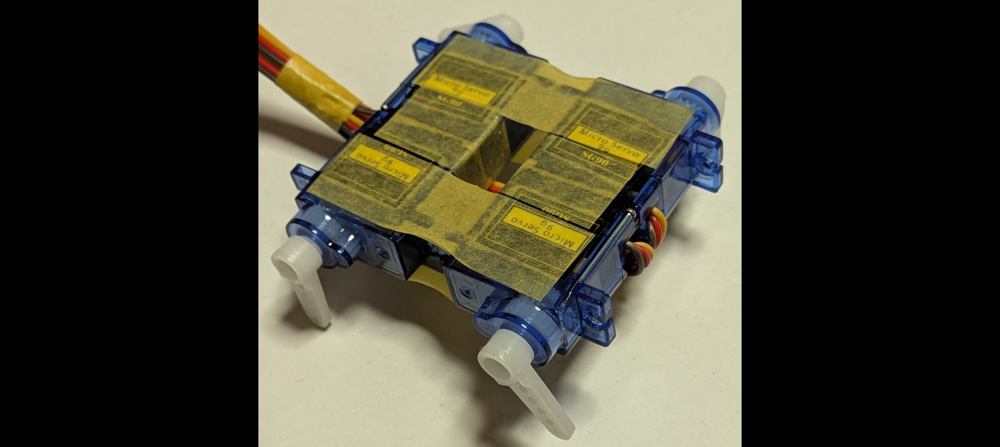

# Tiny Robot Demo の動かし方

`piservo0` を使ったシンプルな四足歩行ロボットです。



## == Install 

### 1. pigpioのインストールと設定

```
# `pigpio`パッケージのインストール
# すでにインストールされていることが多いです。
sudo apt install pigpio

# pigpioサービスの自動起動設定
sudo systemctl enable pigpiod.service
sudo systemctl start pigpiod.service
```


### 2. `uv`のインストールと設定

```
curl -LsSf https://astral.sh/uv/install.sh | sh

# PATHの設定
# 以下を、.bashrc, .zshrcなどに登録することが望ましい。
export PATH=$PATH:~/.local/bin
```


### 3. 'piservo0'のダウンロード(クローン)とインストール

```
git clone https://github.com/ytani01/piservo0.git

cd piservo0  # **重要**
uv venv   # venv作成 (ただし、activateは**しない**)

uv pip install -e .
uv pip install -e '.[dev]'
uv pip install -e '.[sample]'
```


## == Tiny Robot Demo の実行

### 1. 歩くデモの実行

``` bash
uv run python -m samples.tiny_robot.py devmo1 17 27 23 25
```

### 2. マニュアルモードの実行

``` bash
uv run python -m samples.tiny_robot.py devmo1 17 27 23 25
```

### 3. スクリプト実行モード

``` bash
uv run python -m samples.tiny_robot.py exec 17 27 23 25 samples/tiny_robot/script2-hi.txt
```

### 4. Web API デモ

**4.1 WebAPI起動**

``` bash
uv run uvicorn sample.tiny_robot.web:app --reload --host 0.0.0.0
```

**4.2 ブラウザなどからアクセス**

URL: http://IPaddr:8000/docs
